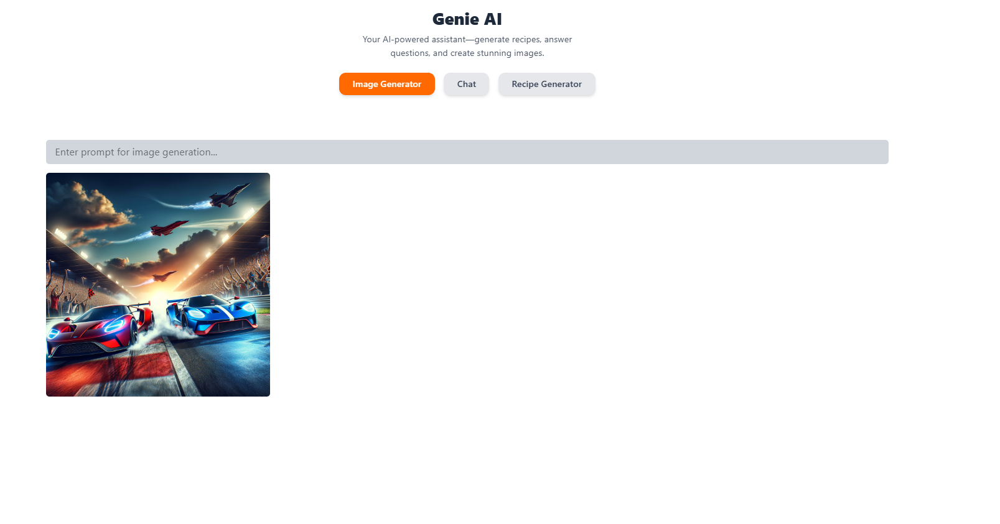
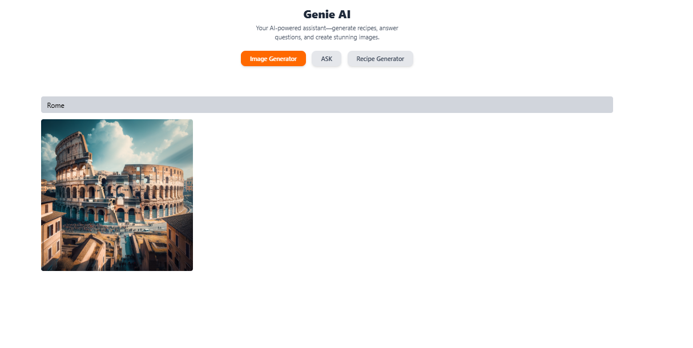
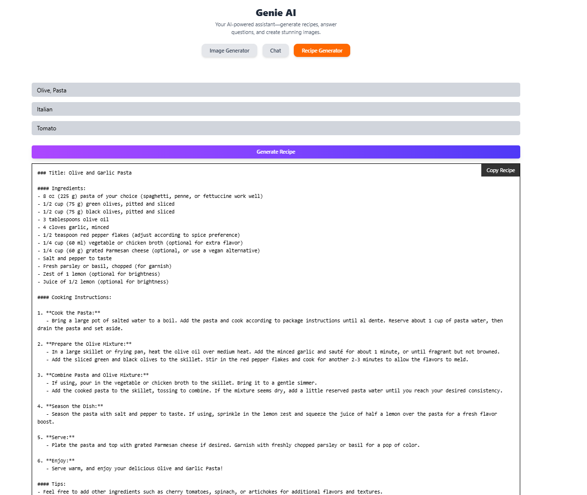
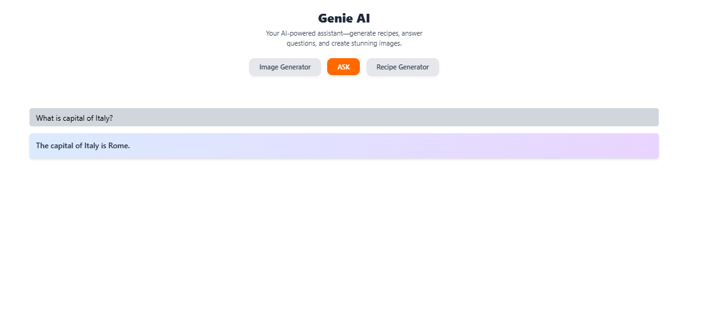

# Genie AI

Genie AI is an AI-powered assistant designed to help users with cooking-related tasks. It can generate recipes based on ingredients, answer any cooking-related questions, and create stunning food images from text descriptions.

## Features
- **Recipe Generator**: Input ingredients, and Genie AI will suggest delicious recipes you can make with them.
- **Cooking Assistant**: Ask Genie AI cooking-related questions, and it will provide helpful answers and tips.
- **Food Image Generator**: Describe a dish or ingredient, and Genie AI will generate a stunning image of the food.
  
## How It Works
1. **Recipe Generation**: You can enter a list of ingredients you have, and Genie AI will use its deep learning models to suggest a recipe based on those ingredients.
2. **Answering Questions**: Ask questions related to cooking, ingredients, or nutrition, and Genie AI will provide an accurate and helpful response.
3. **Food Image Generation**: By describing a dish or food in text, Genie AI will generate an image that represents the description.

## Screenshot
Here is a preview of the Genie AI interface in action:

